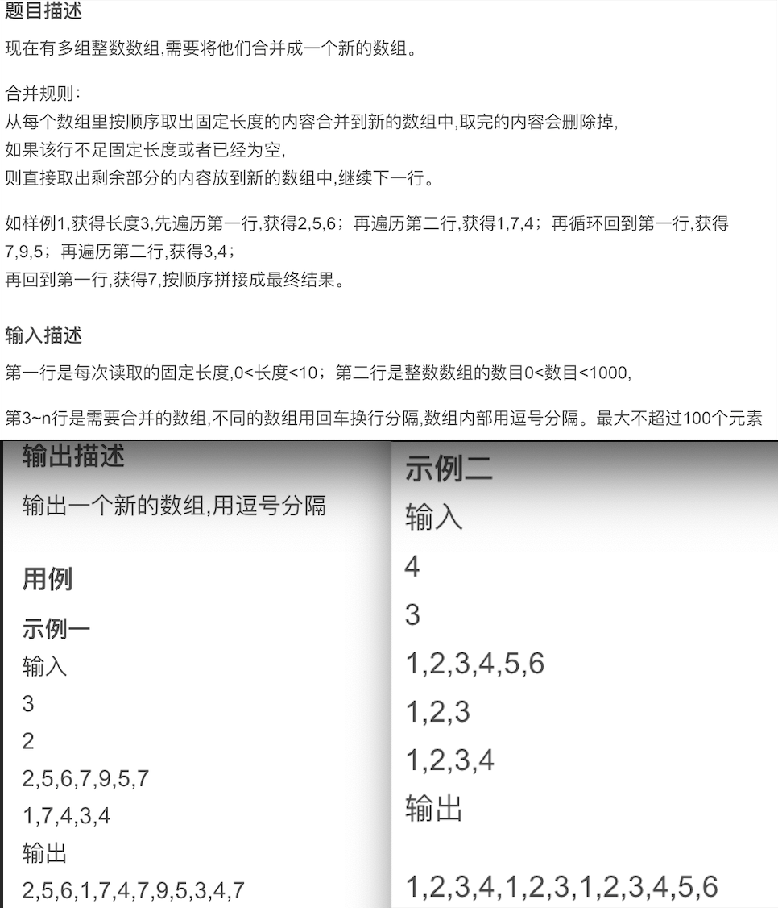

# Algorithm-2023

### 合并数组

原题连接：https://blog.csdn.net/banxia_frontend/article/details/129506402



```scss
我的理解：
给出若干个数组，然后顺序遍历它们、从每个数组中顺序取出固定个数的元素追加到新数组中，并删除遍历数组中取出的元素。直到给出的数组元素全部删除完毕，最后输出新数组。

但是！但是！但是！由于这里需要告诉程序【每次读取的范围】、【数组的数量】、【全部数组的具体内容】、所以需要设置对应的输入项，大致如下（这项内容都是需要用键盘输入并由程序接收的）
1、输入一个数代表每次读取的长度，范围(0,10) 比如用字母k代替
2、输入数组的数目，范围(0,1000)比如用字母n代替
3、输入n行数组，元素之间用逗号隔开，数组之间用回车键隔开
关于【输入作为用例】、【输出作为结果】的设计挺恶心的，没办法，目前只能照做！

实现代码见工程中的 ArrayMerge.cpp 文件、在main函数中调用类中函数即可。
```

