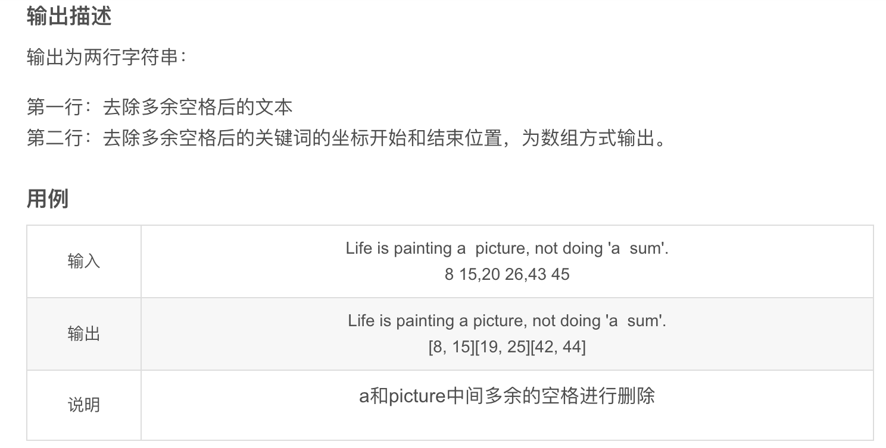
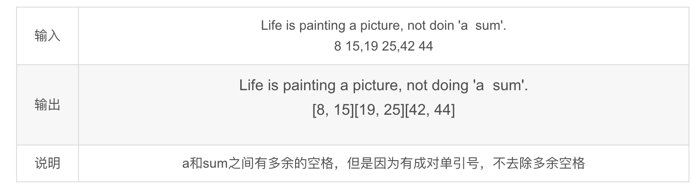
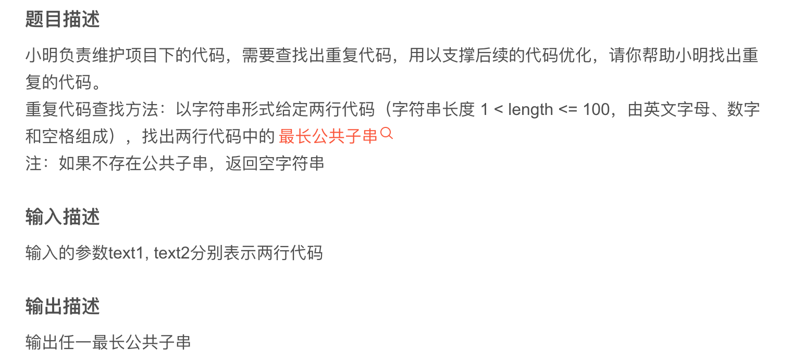
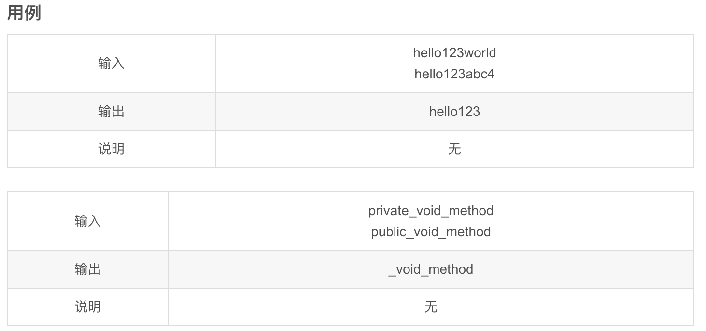
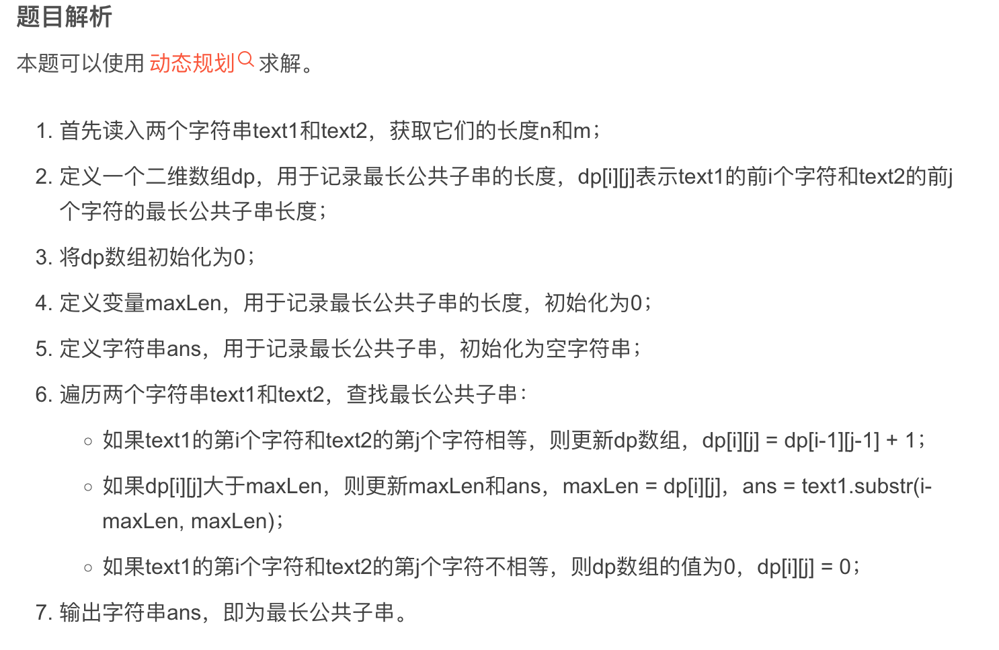

# Algorithm-2023

### 合并数组

原题连接：https://blog.csdn.net/banxia_frontend/article/details/129506402


```scss
实现代码见工程中的 ArrayMerge.cpp 文件、在main函数中调用类中函数即可。
```

### 去除多余空格






```scss
RemoveSpaces
```

### 查找重复代码







```scss
FindRepeatCode
```

