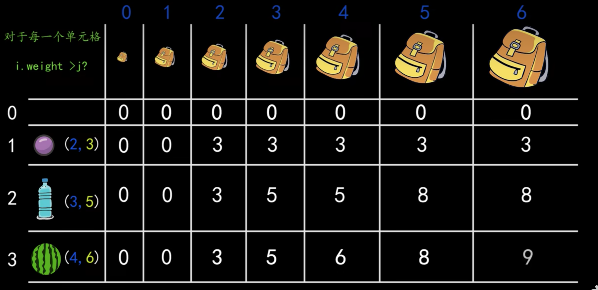

# 华为机试题-C++

## 写在前面

题目连接：https://www.nowcoder.com/practice/8c949ea5f36f422594b306a2300315da?tpId=37&tags=&title=&difficulty=&judgeStatus=&rp=1&sourceUrl=%2Fexam%2Foj%2Fta%3FtpId%3D37

bilibili有大佬视频讲解：https://www.bilibili.com/video/BV1n5411t7WL/?p=5&spm_id_from=pageDriver&vd_source=87cc6260455baa464f9ef75f23eed89b

```scss
牛客网华为算法题目主要考察两个部分
1、输入部分、其实就是题目的输入数据
2、输出部分、就是根据算法求得得结果【这部分包含算法+输出】
输入输出都是不能忽视的重点、不同于leecode考察的更纯粹一些，只能说各有特色吧。虽然输入输出这部分很恶心，但是不能忽视，要不然牛客的题目你懂了也做不出来。。。这真的很坑爹。。。在牛客网找到01背包算法题后、发现牛客并没有要求输入、看来是华为要求的。。。

以下代码均为C++、代码存在瑕疵、突出简单易懂。更好的代码和思路请参考牛客网内大神的分享，以及B站视频
```


#### HJ1 字符串最后一个单词的长度

```c++
#include<iostream>
#include<string>
using namespace std;
int main() {
    string words;
    getline(cin, words);
    int lastWordLen = 0;//注意！一定要出实话，否则会报错
    for(int i = words.size()-1; i >= 0; i--) {
        if(words[i] == ' ') {
            break;
        }
        //注意++不要放在判断空格之前，因为空格不计算长度
        lastWordLen++;
    }
    cout << lastWordLen << endl;
    return 0;
}
```

#### HJ2 计算某字符出现次数

```c++
#include <iostream>
#include <string>
using namespace std;
int main() {
    string str;
    getline(cin, str);
    char x;
    cin >> x;
    int count = 0;
    //判断x是大写字母 还是小写字符
    bool isBig = false;
    if (x < 97) { //97 是a. 65是A 
        isBig = true;
    }
    for (size_t i = 0; i < str.size(); i++) {
        if (x < 'A' || x > 'z') {//非字母
            if (str[i] == x) {
                count++;
            }
        } else {//英文字母 要忽略大小写
            if (isBig) {
                if (str[i] == x || str[i] == (x + 32)) {
                    count++;
                }
            } else {
                if (str[i] == x || str[i] == (x - 32)) {
                    count++;
                }
            }
        }
    }
    cout << count << endl;
    return 0;
}
```

#### HJ1 字符串最后一个单词的长度

```c++
#include<iostream>
#include<string>
using namespace std;
int main() {
    string words;
    getline(cin, words);
    int lastWordLen = 0;//注意！一定要出实话，否则会报错
    for(int i = words.size()-1; i >= 0; i--) {
        if(words[i] == ' ') {
            break;
        }
        //注意++不要放在判断空格之前，因为空格不计算长度
        lastWordLen++;
    }
    cout << lastWordLen << endl;
    return 0;
}
```

#### HJ2 计算某字符出现次数

```c++
#include <iostream>
#include <string>
using namespace std;
int main() {
    string str;
    getline(cin, str);
    char x;
    cin >> x;
    int count = 0;
    //判断x是大写字母 还是小写字符
    bool isBig = false;
    if (x < 97) { //97 是a. 65是A 
        isBig = true;
    }
    for (size_t i = 0; i < str.size(); i++) {
        if (x < 'A' || x > 'z') {//非字母
            if (str[i] == x) {
                count++;
            }
        } else {//英文字母 要忽略大小写
            if (isBig) {
                if (str[i] == x || str[i] == (x + 32)) {
                    count++;
                }
            } else {
                if (str[i] == x || str[i] == (x - 32)) {
                    count++;
                }
            }
        }
    }
    cout << count << endl;
    return 0;
}
```

#### HJ3 明明的随机数[set去重]

```c++
#include<string>
#include<iostream>
#include<set>
using namespace std;

int main() {
    int N;
    cin >> N;//接收随机数N
    int random;
    //用set来存储数据、目的是去重 而且set 默认从小到大排序
    set<int>s;
    for(int i = 0; i < N; i++) {//接收N个随机数保存到set
        cin >> random;
        s.insert(random);
    }
    for(auto t:s) {
        cout << t << endl;
    }
    return 0;
}
/*
set集合默认从小到大排序、集合特点不重不漏
*/
```

#### HJ4 字符串分隔

```c++
#include<iostream>
#include<string>
using namespace std;

int main() {
    string str;
    while(getline(cin, str)) {
        if(str.size() == 0) {
            break;//不处理
        }
        string tmp;
        for(int i = 0; i < str.size(); i++) {
            tmp += str[i];
            if(tmp.size()%8 == 0) {//注意这里的判断用tmp的长度
                cout << tmp << endl;
                tmp.clear();
                continue;
            }
            if(i == str.size()-1) {//遍历到最后时
                while(tmp.size() < 8) {//这里用while比for更简单
                    tmp += '0';
                }
                cout << tmp << endl;
                break;
            }
        }
    }
    return 0;
}
```

#### HJ5 进制转换[16->10]

```c++
#include<iostream>
#include<string>
using namespace std;

int hex_dec(char ch) {
    if(ch == 'A') {
        return 10;
    }
    if(ch == 'B') {
        return 11;
    }
    if(ch == 'C') {
        return 12;
    }
    if(ch == 'D') {
        return 13;
    }
    if(ch == 'E') {
        return 14;
    }
    if(ch == 'F') {
        return 15;
    }
    return ch - '0';//将整型字符转成整形
}

int main() {
    string hex;
    cin >> hex;
    //反向遍历，到第一个有效位结束
    int index = -1;
    long num = 0;
    for(int i = hex.size()-1; i > 1; i--) {
        index++;
        if(index == 0) {
            num += hex_dec(hex[i]);
        }
        if(index == 1) {
            num += hex_dec(hex[i]) * 16;
        }
        if(index == 2) {
            num += hex_dec(hex[i]) * 16 * 16;
        }
        if(index == 3) {
            num += hex_dec(hex[i]) * 16 * 16 * 16;
        }
        if(index == 4) {
            num += hex_dec(hex[i]) * 16 * 16 * 16 * 16;
        }
        if(index == 5) {
            num += hex_dec(hex[i]) * 16 * 16 * 16 * 16 * 16;
        }
    }
    cout << num << endl;
    return 0;
}
/*
直接用的进制转换的笨蛋办法、没有使用Api、而且这里也仅仅是跑过用例了；
不过还有两种简单的办法（不建议使用api）
1、直接api将16进制转换成10进制
2、直接api将16进制内容以10进制形式输出
*/
```

#### HJ6 质数因子[质因数<该数开根号]

```c++
解题思路 先百度了一下什么是质因子，然后如果判断当前数是否是质数
记住一个结论 【一个正整数的质因子一定<=它本身开根号】不用这个结论将会导致计算超时
#include<iostream>
using namespace std;

// 判断是否是质数[关键函数]
bool isZhiShu(int x) {
    if(x < 2) return false;
    for(int i = 2; i*i<=x; i++) {//这里的i可以优化为基数甚至更佳
    //注意这里 i<x 所以不会除到自身，所以x==2时 也没问题
        if(x%i==0) return false;
    }
    return true;
}

// 获取x的下一个质数
int nextZhiShu(int x) {
    while(true) {
        x++;
        if (isZhiShu(x)) {
            return x;
        }
    }
    return -1;//出错了！
}

int main() {
    int n;
    cin >> n;
    if(isZhiShu(n)) {
        cout << n;
        return 0;
    }
    string result;
    
    int index = 2;
    while (true) {
        if(n == 1) break;
        if(isZhiShu(n)) {
            result += to_string(n) + " ";
            break;
        }
        if(n%index==0) {//能否被质数整出
            n = n/index;
            result += to_string(index) + " ";
            continue;//可能存在重复的质因子，所以continue
        }
        index = nextZhiShu(index);
    }
    cout << result << endl;
    return 0;
}
/*
题目的难点在于
1、如何判断一个数是否是质数
2、需要记住一个结论：一个整数的质因数不会>这个整数开根号后的数
*/
```

#### HJ7 取近似值

```c++
#include<iostream>
using namespace std;

int main() {
    double x;
    cin >> x;
    int r = x + 0.5;
    cout << r << endl;
    return 0;
}
/*
计算机中当一个浮点型数据强制转换成整型数据时 并不是 四舍五入 的计算，而是将小数点后的数全部去除，保留整数位。利用这个特性 给浮点数+0.5即可、因为这样就达到了 “四舍五入”的效果
*/
```

#### HJ8 合并表记录[字典去重]

```c++
#include<iostream>
#include<string>
#include<map>
using namespace std;

int main() {
    int kvNum;
    cin >> kvNum;
    map<int, int>myMap;
    for(int i = 0; i < kvNum; i++) {
        int k,v;
        cin >> k >> v;//fxw 注意 题目中输入的是整行字符串用空格隔开的，这里可以用cin来接收、因为空格会自动接入前一个输入、第二个输入后回车也会结束掉，之前傻逼了 用 getline(cin, str)来接收，这样还要切割子串 然后将字符串转换成整型 相当恶心。。。
        myMap[k] += v;
    }
    for(auto t:myMap) {
        cout << t.first << " " << t.second << endl;
    }
    return 0;
}
/*
字典是有序的、去重的
利用字典来累加结果即可
需要特别注意的是 这里键值对的获取用的是cin 而不是getline，前者获取后直接就可以设置成整型数据、后者获取到是一个字符串 还需要转换成整型比较麻烦
*/
```

#### HJ9 提取不重复的整数[去重]

```c++
#include<iostream>
using namespace std;

int main() {
    string numStr;
    cin >> numStr;

    string result;
    //注意 i>=0 否则第一个字符遍历不到
    for(int i = numStr.size()-1; i >= 0; i--) {
        bool hasSub = false;
        if(result.size() > 0) {
            for(int j = 0; j < result.size(); j++) {
                if(result[j] == numStr[i]) {
                    hasSub = true;
                }
            }
        }
        if(!hasSub) {
            result += numStr[i];
        }
    }
    cout << result << endl;
    return 0;
}
/*
输入字符串后、逆序遍历、然后生成子串、在生成子串时判断添加的字符是否已包含在子串中、不包含才追加、最后输出结果
*/
```

#### HJ10 字符个数统计[字典去重]

```c++
#include<iostream>
#include<map>
using namespace std;

int main() {
    string str;
    getline(cin, str);
    map<char, int>myMap;
    for(int i = 0; i < str.size(); i++) {
        myMap[str[i]] = 1;
    }
    cout << myMap.size() << endl;
    return 0;
}
```

#### HJ11 数字颠倒[反向遍历]

```c++
#include<iostream>
using namespace std;

int main() {
    string str;
    getline(cin, str);
    for(int i = str.size()-1; i >= 0; i--) {
        cout << str[i];
    }
    return 0;
}
/*
就是反向遍历输出输入的字符串
*/
```

#### HJ12 字符串反转[同HJ11]

```c++
#include <iostream>
#include<string>
using namespace std;

int main() {
    string str;
    getline(cin, str);
    for(int i = str.size()-1; i >= 0; i--) {
        cout << str[i];
    }
    return 0;
}
```

#### HJ13 句子逆序

```c++
#include <iostream>
#include <list>
#include <string>
using namespace std;

int main() {
    string str;
    getline(cin, str);
    string tmp;
    list<string>ls;
    for(int i = 0; i < str.size(); i++) {
        if(str[i] == ' ') {
            ls.push_back(tmp);
            tmp ="";
            continue;
        }
        tmp += str[i];
        if(i == str.size()-1) { //添加最后一个单词
            ls.push_back(tmp);
        }
    }

    while (!ls.empty()) {
        cout << ls.back() << " ";
        ls.pop_back();
    }
    return 0;
}
/*
将句子中的单词逆序输出
首先想到的是要用一个有序的集合来保存单词，于是用到了list、接着再逆序输出就好，list是连标所以不能直接访问下标，如果是字符串数组的话就更简单了 如下：
*/

#include <iostream>
#include <string>
using namespace std;

int main() {
    string str;
    getline(cin, str);
    string tmp;
    int arrLen = 1000;//题目给出了长度限制
    string words[arrLen];
    for(int i = 0; i < str.size(); i++) {
        if(str[i] == ' ') {
            words[i] = tmp;
            tmp ="";
            continue;
        }
        tmp += str[i];
        if(i == str.size()-1) { //添加最后一个单词
            words[i] = tmp;
        }
    }

    for(int i = arrLen-1; i >= 0; i--) {
        if(words[i] !="") {
            cout << words[i] << " ";
        }
    }
    return 0;
}
```

#### HJ14 字符串排序[字典value记录重复次数]

```c++
#include <iostream>
#include <map>
using namespace std;

int main() {
    int n;
    cin >> n;
    cin.ignore();
    map<string,int> myMap;
    string str;
    for (int i = 0; i < n; i++) {
        getline(cin, str);
        myMap[str]++;
    }

    for(auto t:myMap) {
        for(int i = 0; i < t.second; i++) {
            cout << t.first << endl;
        }
    }
    return 0;
}
/*
输入n行单词，然后根据字典顺序输出这些单词，注意这里可能会有重复的单词
将单词保存在字典中、key是单词、value是单词出现的次数
字典保存的顺序默认就是字典序，然后遍历并输出，注意根据value值有多少个就输出多少个(重复的情况)
*/
```

#### HJ15 求int型正整数在内存中存储时1的个数[进制转换10->2]

```c++
//思路一
#include<iostream>

using namespace std;

//十进制数字转成二进制字符串
string Binary(int x) {
    string s = "";
    while (x) {
        if (x % 2 == 0) s = '0' + s;
        else s = '1' + s;
        x /= 2;
    }
    return s;
}

int main() {
    int x;
    cin >> x;
    int count = 0;
    string binaryStr = Binary(x);
    for(int i = 0; i < binaryStr.size(); i++) {
        if(binaryStr[i] == '1') {
            count++;
        }
    }
    cout << count << endl;
    return 0;
}

//思路二【推荐，实现起来更容易一些】
#include<iostream>
using namespace std;
int main() {
    int x;
    cin >> x;
    int count = 0;
    while(x) {
        if(x & 1) {//相当于 二进制的　 ..x & 1 除了第一位前面的二进制位全为0
            count++;
        }
        x = x>>1;//将x的二进制位右移1位
    }
    cout << count << endl;
    return 0;
}

/*
思路一：将十进制输入转换成二进制字符串，然后判断里面有多少个1，难点在于进制之间的转换
思路二：判断二进制数的最后一位是否为1，进行累加，每次判断后再将整个数右移1位继续判断。这里需要知道右移的知识
左移 是对一个数的二进制向左移动1位，低位补零
右移 是对一个数的二进制向右移动1位，高位补零
&运算 是对两个数的二进制位进行与运算 都为1则为1、否则为0
参考：https://blog.csdn.net/weixin_42837024/article/details/98734787

直观上思路一更好理解、但是实现起来思路二更容易一些（思路一是进制转换二进制字符串不好理解）
*/
```

#### HJ16 购物单[动态规划-01背包]

```c++
/*
这个题比较难，属于【动态规划】里的【01背包问题】
建议先学习解决【01背包问题】然后在来看这道题

01背包问题视频(不推荐看顶部的视频，下面的视频更好理解)
https://www.bilibili.com/video/BV1pY4y1J7na/?spm_id_from=333.337.search-card.all.click&vd_source=87cc6260455baa464f9ef75f23eed89b

牛客网的【NC145 01背包】，去搜索能找到，力扣上需要充会员。。。
*/
```

以下截图来自上面B站视频
01背包分析图，二维数组、推到顺序是以行为单位、逐行循环推到，直到最后一行最后一个，也就是最终的答案



难点在于对【递推公式】的理解

```c++
#参考：https://blog.csdn.net/BabyCrys/article/details/104747308
#include<algorithm>
#include<iostream>
using namespace std;
int main() {
    int n;//n个物品
    int v;//背包体积
    cin>>n>>v;
    
    //注意此处的N至少要比最大范围多1
    const int N=1001;
    int V[N];//每个物品对应的体积
    int W[N];//每个物品对应的价值
    //存储输入
    for(int i=1;i<=n;i++) {
        cin>>V[i]>>W[i];
    }
    
    int f[N][N];//用来存放结果
    for(int i=1;i<=n;i++) {
        //背包容量需从0,...,v
        for(int j=0;j<=v;j++) {
//当前背包体积<当前物品体积，装不下当前物品、那么当前背包体积的最大值就是：前一个物品放进背包后的最大值
            if(j<V[i]) {
                f[i][j]=f[i-1][j];
            } else {
//当前背包体积>当前物品体积，可以装下当前物品、那么当前背包体积的最大值就是：(放入当前物品前的最大值) 和 (放入当前物品后，背包的值+剩余体积的最大值) 之间的最大值
                f[i][j]=max(f[i-1][j],f[i-1][j-V[i]]+W[i]);
            }
        }
    }
    cout << f[n][v] << endl;
    return 0;
}
```

如果上面的代码不好理解，接着推荐更优的解决办法
参考：https://www.acwing.com/solution/content/116859/

#### HJ21 简单密码

```c++
# 用的最笨的方法做的
#include<iostream>
#include <string>
using namespace std;

int main() {
    string str;
    string result;
    cin >> str;
    for(size_t i = 0; i < str.size(); i++) {
        if(str[i] == '1' || str[i] == '0') {
            result += str[i];
            continue;
        }
        if(str[i] >= 'a' && str[i] <= 'c') {
            result += '2';
            continue;
        }
        if(str[i] >= 'd' && str[i] <= 'f') {
            result += '3';
            continue;
        }
        if(str[i] >= 'g' && str[i] <= 'i') {
            result += '4';
            continue;
        }
        if(str[i] >= 'j' && str[i] <= 'l') {
            result += '5';
            continue;
        }
        if(str[i] >= 'm' && str[i] <= 'o') {
            result += '6';
            continue;
        }
        if(str[i] >= 'p' && str[i] <= 's') {
            result += '7';
            continue;
        }
        if(str[i] >= 't' && str[i] <= 'v') {
            result += '8';
            continue;
        }
        if(str[i] >= 'w' && str[i] <= 'z') {
            result += '9';
            continue;
        }
        if(str[i] >= 'A' && str[i] <= 'Y') {
            result += str[i]+32 + 1;
            continue;
        }
        if(str[i] == 'Z') {
            result += 'a';
            continue;
        }
        result += str[i];
    }
    cout << result << endl;
    return 0;
}
```


## 总结

```scss
关于输入部分一定要用对函数
cin 用于接收非空格的内容，可以是基本数据类型/字符串/字符
getline(cin, str) 用于接收整行内容 可以包含空格等字符
gets(charArr) 和getline一样，不过这里的参数是字符数组
cin.ignore() 通常用来忽略cin输入的回车换行符
```

### 实际考题-2023-06-18

总结：三道大题整体感觉都不难，但是自己学习不够用功，第二道题都没能做全对。卡在了最后的排序问题上
暂时还没有做出来，先同步到git吧。

```scss
#include <iostream>
#include <string>
#include <map>
#include <regex>
using namespace std;

//将字符串中所有的非字母去除，这里如果会用正则就简单很多了，这里不知道正则 字符取反该怎么写。。。
//regex_replace(str, regex("[a-z,A-Z]"), "");//这里中间的正则要取反才行
string removeFeiString(string str) {
    string result;
    for(int i = 0; i < str.size(); i++) {
        if(str[i] >= 'a' && str[i] <= 'z') {
            result += str[i];
        } else if (str[i] >= 'A' && str[i] <= 'Z') {
            result += str[i];
        }
    }
    return result;
}

//将字符串全部转换成小写字母
void allXiaoXie(string &str) {
    string result;
    for(int i = 0; i < str.size(); i++) {
        if(str[i] >= 'A' && str[i] <= 'Z') {
            str[i] = str[i] + 32;
        }
    }
}

// 返回给定字符串、索引之后 c 出现的次数
int countIndex(string str, char c, int index) {
    int count = 0;
    for (int i = index; i < str.size(); i++) {
        if(c == str[i]) {
            count++;
        }
    }
    return count;
}

/*
 1、去除字符还中非字母的部分
 2、将字符串中的字母全部转换成小写
 3、如果字符后面出现了连续的相同的字符，要去掉，并修改为当前连续出现的字符的个数
 4、如果字符后面没有出现连续的相同的字符，要加上之后出现这个字符的个数
 5、最后输出满足条件的字符串、要求字母按升序排列、相同的字母后面的数字大的排在前面
 
 用例如下：
 输入：aaBbcc
 输出：a2b2c2

 输入：bAaAcBb
 输出：a3b2b2c0
 */

//第二题
void second() {
    string str;
    getline(cin, str);
    allXiaoXie(str);//全部转换成小写
        str = removeFeiString(str);//去除非字母
        int count = 1;
        string result;
        map<string, int>myMap;
        for(int i = 0; i < str[i] - 1; i++) {
            if(str[i] == str[i+1]) {
                count++;
            } else {
                //判断之前是否连续
                if(count >= 2) {//连续
                    myMap[str[i-1]+to_string(count)] += 1;
                    count = 1;
                    continue;
                } else {
                    myMap[str[i]+to_string(countIndex(str, str[i], i+1))] += 1;
                    count = 1;
                }
            }
        }
        for(auto t:myMap) {//注意这里的字典序就是升序，字母会从小到大排，但是有个问题，数字是第二位，所以不会按照数字的升序排列
            //如何解决这个问题呢？比如 将a2a3b2 转换成 a3a2b2
            int times = t.second;
            for(int i = 0; i < times; i++) {//当有多个相同的 （小写字母+数字）比如 a2 时，会一起输出
                result += t.first;
            }
        }

    cout << result << endl;
}


//--------------------------------------分割线----------------------------------------
bool hasSameSub(string a, string b) {
    string moreLong = a.size()>b.size()?a:b;
    string moreshore = a.size()>b.size()?b:a;
    for(int i = 0; i < moreLong.size(); i++) {
        for(int j = 0; j < moreshore.size(); j++) {
            if(moreLong[i] == moreshore[j]) {
                return true;
            }
        }
    }
    return false;
}

//第一题
/*
 1、输入一行字符串 用英文逗号间隔 比如 ken,shin,ki,bou
 2、找出连个彼此不包含对方字符的字符串，并相乘它俩的长度，要求返回一个最大的乘积
 */
void first() {
    string str;
    getline(cin, str);
    vector<string>myVec;
    string sub;
    for(int i = 0; i < str.size(); i++) {
        if(str[i] == ',') {
            myVec.push_back(sub);
            sub.clear();
            continue;
        }
        sub += str[i];
        if(i == str.size()-1) {
            myVec.push_back(sub);
        }
    }

    int result = 0;
    for(int i = 0; i < myVec.size(); i++) {
        for(int j = 1; j < myVec.size(); j++) {
            if(!hasSameSub(myVec[i], myVec[j])) {
                int a = myVec[i].size();
                int b = myVec[j].size();
                result = max(result, a*b);
            }
        }
    }
    cout << result << endl;
}

int main() {
    //first(); 100分到手
    second();//54分到手、没拿到一百分、是因为最后的结果没有做排序
    return 0;
}

```

